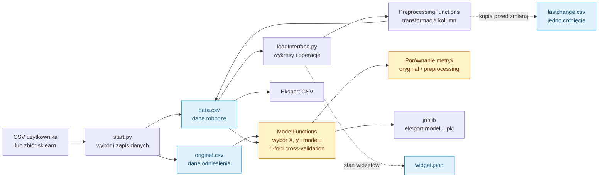
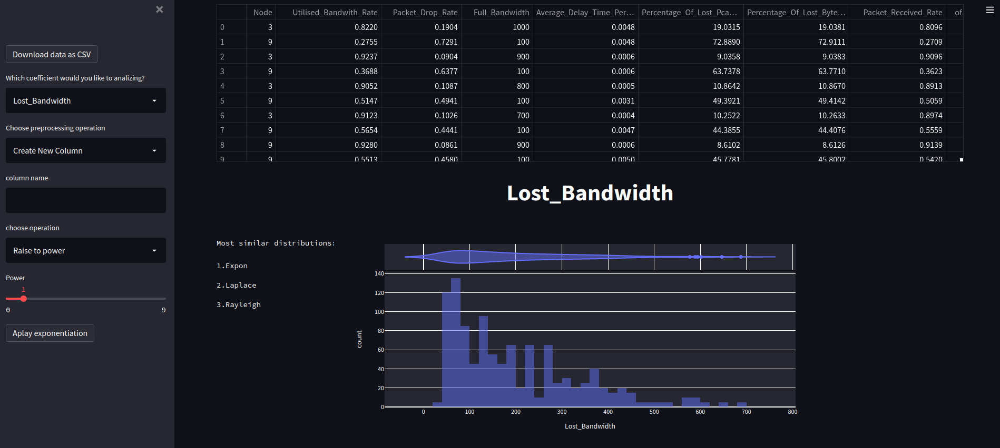
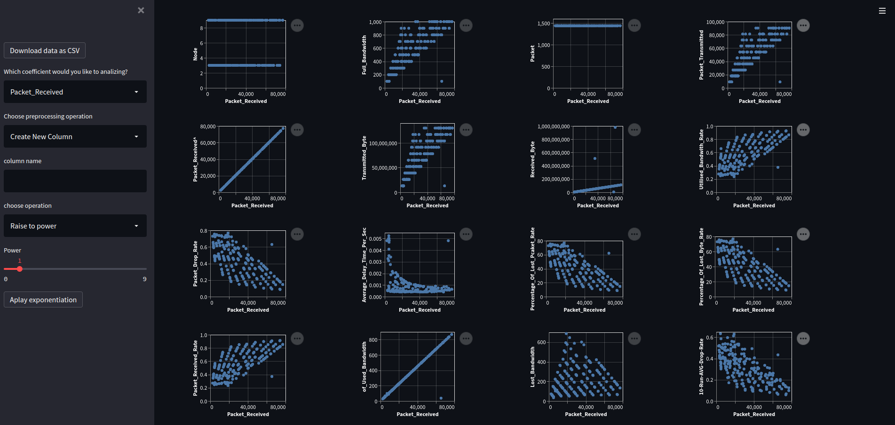

# InteligentMachineLearningStreamlit

Interaktywna aplikacja **Streamlit** do eksploracji danych tabelarycznych, ręcznego preprocessingu i porównywania modeli scikit-learn na danych oryginalnych oraz przekształconych. Użytkownik wybiera CSV lub przykładowy zbiór, modyfikuje kolumny, ogląda wykresy i uruchamia ocenę modelu.

Projekt jest narzędziem eksperymentalnym. Nie wybiera samodzielnie najlepszego modelu i nie implementuje kompletnego AutoML. Aktualna ocena ma problemy z etykietami metryk i wyciekiem informacji podczas preprocessingu, opisane poniżej.

## Spis treści

- [Przepływ aplikacji](#przepływ-aplikacji)
- [Preprocessing i jego algorytmy](#preprocessing-i-jego-algorytmy)
- [Modele uczenia maszynowego](#modele-uczenia-maszynowego)
- [Ocena modeli i metryki](#ocena-modeli-i-metryki)
- [Przykładowy eksperyment](#przykładowy-eksperyment)
- [Uruchomienie](#uruchomienie)
- [Ograniczenia implementacji](#ograniczenia-implementacji)

## Przepływ aplikacji



Diagram przedstawia rzeczywisty kierunek przepływu. Preprocessing jest dopasowywany przed walidacją, co ma znaczenie dla interpretacji wyników.

| Plik | Rola |
| --- | --- |
| `start.py` | Punkt wejścia Streamlit, upload CSV i wybór zbioru. |
| `loadInterface.py` | Panel operacji, wykresy, wybór cech i celu oraz porównanie wyników. |
| `Functions/PreprocessingFunctions.py` | Przekształcenia danych i heurystyki typów kolumn. |
| `Functions/ModelFunctions.py` | Konfiguracja estimatorów, podział danych i cross-validation. |
| `Functions/ChartsFunctions.py` | Histogramy, scatter plots, korelacje i testy rozkładów. |
| `Functions/FileSystemFunctions.py` | Zapis CSV, kopia ostatniej zmiany i pobieranie plików. |
| `Functions/JsonHandler.py` | Odczyt i zapis ustawień widżetów. |
| `widget.json` | Początkowy stan aplikacji. |

Dostępne zbiory przykładowe: Iris, Diabetes, Wine i Breast Cancer. Warunek dla Linnerud występuje w kodzie, ale nie ma go na liście wyboru. W repozytorium znajdują się także `CPU prices - Desktop-Mobile.csv` i `dvbt.csv`.

## Preprocessing i jego algorytmy

### Rozpoznanie kolumn

`getNumericalColumns()` wybiera wyłącznie kolumny o dtype `int64` i `float64`. `getClassificationColums()` uznaje kolumnę za klasyfikacyjną, gdy ma nie więcej niż sześć różnych wartości. Jest to heurystyka interfejsu, nie ustalenie znaczenia danych: liczba ocen 1–5 może być celem regresji, a klasyfikacja z dziesięcioma klasami nie spełni tej reguły.

### Transformacje skali

| Operacja w UI | Mechanizm w kodzie | Znaczenie |
| --- | --- | --- |
| `Scale` | `x' = x × 10^p`, `p` od −10 do 10. | Zmiana jednostki, bez dopasowania rozkładu. |
| `Resize Range` | `x' = (x−min)/(max−min) × (b−a) + a`. | Przeniesienie zakresu do `[a,b]`. Stała kolumna wymaga obsługi zerowego mianownika. |
| `Normalization` | `MinMaxScaler`, zwykle do `[0,1]`. | Skalowanie każdej cechy względem minimum i maksimum; nie jest normalizacją długości wiersza. |
| `Standarization` | `StandardScaler`: `z = (x−μ)/σ`. | Centrowanie i wyrównanie skali; nie wymusza rozkładu normalnego. |
| `Robust Scaler` | Odjęcie mediany i podział przez rozstęp międzykwartylowy. | Ograniczenie wpływu wartości odstających na parametry skali. |
| `Quantile Transformer` | Dopasowanie kwantyli i mapowanie do rozkładu uniform lub normal. | Nieliniowa zmiana odstępów między wartościami, przy zachowaniu ich porządku. |
| `Power Transformer` | Yeo–Johnson lub Box–Cox. | Transformacja potęgowa ograniczająca skośność; Box–Cox wymaga wartości dodatnich. |

Funkcje odpowiadają wywołaniom transformerów w repozytorium. Szczegóły ich parametrów opisuje [dokumentacja preprocessingu scikit-learn 1.0](https://scikit-learn.org/1.0/modules/preprocessing.html).

Przykład min–max dla `[10, 20, 30]`: wynik to `[0, 0.5, 1]`. Nowa obserwacja `40` może otrzymać `1.5`, jeżeli użyjemy wcześniej dopasowanej skali; nie należy dopasowywać jej od nowa do pojedynczej obserwacji.

Przy standaryzacji średnia tego zbioru wynosi `20`, a odchylenie standardowe używane przez `StandardScaler` około `8.165`; wynik to około `[-1.225, 0, 1.225]`. Zmienia się skala, nie informacja o kolejności punktów.

### Tworzenie cech i analiza rozkładu

Interfejs pozwala zmieniać nazwę, usuwać i duplikować kolumny, dodawać lub mnożyć wybrane cechy, podnosić do potęgi i logarytmować dodatnie wartości. Transformacja zmienia reprezentację problemu: cecha `x²` pozwala modelowi liniowemu względem parametrów wykorzystać nieliniową zależność od `x`.

Histogramy i korelacje pomagają prześledzić efekt operacji. `histSimilarity()` wywołuje test Kołmogorowa–Smirnowa dla nazwanych rozkładów SciPy z ich domyślnymi parametrami i sortuje wyniki po p-value. Nie dopasowuje parametrów rozkładu do danych; lista „Most similar distributions” nie dowodzi, że dany rozkład opisuje populację.

Obsługa braków, cech wielomianowych i kodowania kategorii jest częściowo niedokończona. Nie wszystkie istniejące funkcje są dostępne z menu.

## Modele uczenia maszynowego

Użytkownik wybiera cechy `X` i kolumnę celu `y`, a `createModel()` tworzy estimator po kliknięciu przycisku. Poniższa tabela wyjaśnia modele występujące w menu i odpowiadające im gałęzie kodu.

| Model | Mechanizm | Co wpływa na zachowanie |
| --- | --- | --- |
| `LinearRegression` | Dopasowanie liniowej sumy cech minimalizującej błąd kwadratowy. | Zależność liniowa, korelacja cech, wartości odstające. |
| `Lasso` | Regresja liniowa z karą L1 na współczynniki. | Parametr kary może wyzerować część współczynników; skala cech ma znaczenie. |
| `DecisionTreeRegressor` / `Classifier` | Kolejne podziały typu `cecha ≤ próg`, kończące się predykcją liścia. | Głębokość i minimum próbek w liściu kontrolują złożoność. |
| `RandomForestRegressor` | Wiele losowanych drzew, predykcja przez średnią ich wyników. | Liczba drzew, losowość i ograniczenia każdego drzewa. |
| `KNeighborsRegressor` / `Classifier` | Wybór najbliższych próbek, średnia albo głosowanie sąsiadów. | `k`, sposób ważenia i skala cech definiują podobieństwo. |
| `LogisticRegression` | Liniowy wynik zamieniany na prawdopodobieństwa klas. | Mimo nazwy jest klasyfikatorem; skala i regularizacja wpływają na dopasowanie. |
| `SGDClassifier` | Aktualizacje parametrów przez stochastyczny spadek gradientu. | Funkcja straty, skalowanie, iteracje i losowa kolejność próbek. |
| `SupportVectorRegression` | Dopasowanie z tolerancją błędu `ε` i karą za większe odchylenia. | Jądro, `C`, `ε` oraz skala danych. |

W menu klasyfikacji znajduje się `RandomForestRegressor`; kod nie zastępuje go `RandomForestClassifier`. Importy KMeans i GaussianNB oraz częściowe gałęzie kodu nie oznaczają gotowej obsługi tych modeli w interfejsie.

Skalowanie szczególnie zmienia odległości w k-NN i zachowanie modeli z regularizacją. Drzewa opierają się na progach, więc monotoniczna zmiana pojedynczej cechy zwykle nie daje takiego samego efektu jak dla modelu odległościowego. Poprawa histogramu sama w sobie nie gwarantuje lepszej predykcji.

## Ocena modeli i metryki

### Rzeczywisty przebieg

`splitData()` tworzy podział 70/30 z `random_state=42`. Jednak `testModel()` nie wykorzystuje przekazanych `trainX`, `validX`, `trainY`, `validY`: uruchamia `cross_val_score(model, X, Y, cv=5)` na całym zbiorze, osobno dla każdej wybranej metryki. Na końcu dopasowuje eksportowany model na całym `X,Y`.

Dla regresji pięć części tworzy `KFold`, a dla klasyfikatora zwykle `StratifiedKFold`; rozkład klas i liczba próbek muszą pozwolić na taki podział. Wynik walidacji jest średnią ocen pięciu modeli pomocniczych. Eksportowany model jest późniejszym dopasowaniem na wszystkich próbkach, nie jednym z tych pięciu modeli.

### Znaczenie metryk i błąd etykiet

Dla reszt `e_i = y_i − ŷ_i`:

```text
MAE  = średnia |e_i|
MSE  = średnia e_i²
RMSE = sqrt(MSE)
MSLE = średnia (log(1+y_i) − log(1+ŷ_i))²
RMSLE = sqrt(MSLE)
```

MAE i RMSE mają jednostkę celu; MSE jednostkę do kwadratu. Błąd kwadratowy silniej karze duże odchylenia. Metryki logarytmiczne wymagają nieujemnych wartości celu i predykcji.

**W obecnej funkcji trzy zmienne są pomylone:**

| Etykieta wyświetlana | Wartość zwracana przez kod |
| --- | --- |
| MAE | Średnie MSE, zapisane do `mae`. |
| MSE | Średnie RMSE, zapisane do `mse`. |
| RMSE | Średnie MAE, zapisane do `rmse`. |
| RMSLE | Średnie MSLE; brak pierwiastka. |

Scikit-learn zwraca te scorery ze znakiem minus; kod go odwraca. „classification score” przy `scoring=None` korzysta z domyślnego `score()` modelu: dla klasyfikatora jest to zwykle accuracy, dla regresora R². Wyświetlanie obu jako procentu klasyfikacji jest mylące.

### Wyciek informacji

Transformery są dopasowywane do całej roboczej tabeli przed podziałem na foldy. W ten sposób minimum, średnia, kwantyle lub parametry transformacji zawierają informacje z późniejszych części walidacyjnych. Wynik może być nadmiernie optymistyczny.

Poprawna ocena wymaga dopasowania preprocessingu wyłącznie na treningowej części każdego foldu, np. przez `Pipeline(transformer, estimator)`. Eksport powinien zachować też dopasowany transformer. Taką zasadę opisuje [dokumentacja scikit-learn o data leakage](https://scikit-learn.org/0.24/common_pitfalls.html#data-leakage). Obecny kod eksportuje sam estimator, więc predykcja na surowych danych nie odtwarza automatycznie transformacji interfejsu.

## Przykładowy eksperyment

1. Wybierz Iris i obejrzyj rozkłady oraz korelacje cech.
2. Ustaw `target` jako cel i pozostałe kolumny jako `X`; nie dodawaj celu do wejścia.
3. Wybierz k-NN i liczbę sąsiadów.
4. Porównaj reprezentację oryginalną z przeskalowaną, uwzględniając opisane ograniczenia oceny.
5. Pobierz roboczy CSV oraz model. Zapisz osobno, jakie operacje i parametry preprocessingu zastosowano.

Nie interpretuj obecnych etykiet błędów regresji bez sprawdzenia tabeli powyżej. Przy klasyfikacji używaj właściwego klasyfikatora i właściwej metryki.

## Uruchomienie

Historyczny zestaw wersji w `requirements.txt` pochodzi z 2021 roku: m.in. Streamlit 1.1.0, pandas 1.3.4 i scikit-learn 1.0.1. Można odtwarzać go w osobnym środowisku Python 3.9; instalacja na znacznie nowszym Pythonie może wymagać aktualizacji zależności i API.

Z katalogu repozytorium:

```bash
python3.9 -m venv .venv
. .venv/bin/activate
python -m pip install -r requirements.txt
streamlit run start.py
```

Uruchomienie z tego katalogu ma znaczenie, ponieważ program buduje ścieżki z `os.getcwd()` i oczekuje lokalnego `widget.json`.

Dockerfile jest szkicem: uruchamia serwer przez `RUN` podczas budowania obrazu i dodatkowo aktualizuje Streamlit ponad wersję przypiętą w requirements. Nie jest gotową konfiguracją uruchomienia kontenera.

## Ograniczenia implementacji

| Obszar | Skutek |
| --- | --- |
| Stan na dysku | `data.csv`, `original.csv`, `lastchange.csv` i modele mają wspólne nazwy dla wszystkich sesji; brak izolacji użytkowników. |
| Ścieżka ustawień | JSON jest czytany z `PWD/widget.json`, ale zapisywany do `../widget.json`; stan nie jest konsekwentnie utrwalany. |
| Min–max i standaryzacja | UI przypisuje zwróconą całą tabelę do podzbioru kolumn numerycznych; przy dodatkowych kolumnach możliwy błąd wymiarów. |
| Usuwanie kolumn | Interfejs wywołuje `dropColumn()` bez listy, a funkcja wykonuje `list(None)`; ścieżka wymaga poprawki. |
| Braki danych | Gałąź mediany wpisuje zero i przypisuje wynik `fillna(..., inplace=True)`; `average()` także nie jest poprawną metodą Series. |
| Parametry | UI dopuszcza `n_quantiles=0`, którego transformer nie akceptuje. |
| Wybór cech | Lista `X` dopuszcza zaznaczenie celu, co może dać bezpośredni wyciek targetu. |
| Wyświetlanie metryk | `if mae:` i podobne warunki ukrywają prawidłowy wynik równy zero. |
| Eksport i losowość | Eksport nie zawiera pełnego preprocessingu; nie każdy estimator ma stały seed. |

Repozytorium nie zawiera automatycznej suity testów. Weryfikacja aplikacji powinna obejmować pełny przebieg na małym CSV, operacje cofania, poprawne przypisanie metryk i brak udziału danych walidacyjnych w dopasowaniu transformacji.

## Zrzuty interfejsu





Historyczny adres demonstracji: [Streamlit app](https://zielony20-inteligentmachinelearningstreamlit-start-5fwi02.streamlitapp.com/). Dostępność wdrożenia nie została zweryfikowana.
